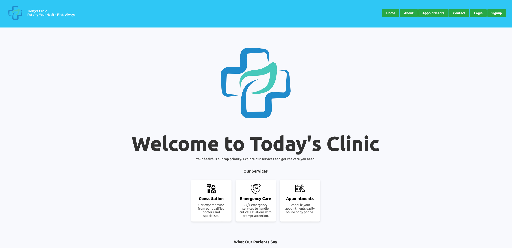

# Clinic Management System

Welcome to the **Clinic Management System** project! This system is designed to streamline clinic operations with a user-friendly interface and a robust backend. It was built using **CSS, HTML, Thymeleaf, Spring MVC, Spring Boot, Spring Security,** and **JPA**.

## 🛠️ Technologies Used

- **Frontend:** HTML, CSS, Thymeleaf
- **Backend:** Spring MVC, Spring Boot, Spring Security
- **Data Management:** JPA

## 📸 Project Overview

### User Interface



The user interface is designed for simplicity and ease of use, featuring a clean and responsive layout.

### Dynamic Pages

Dynamic content is rendered using Thymeleaf, ensuring real-time updates and a seamless user experience.

### Backend Architecture

The backend is powered by Spring MVC, Spring Boot, and Spring Security to handle business logic, authentication, and security efficiently.

### Data Management

Data persistence and management are handled using JPA, providing a reliable and scalable data storage solution.

## 🎥 Video Demo

Watch the [video demo](demo.mp4) to see the system in action and explore its features.

## 🚀 Getting Started

1. **Clone the Repository**

    ```bash
    git clone https://github.com/Khaled12208/PatientsAppointmentsSystem.git
    ```

2. **Navigate to the Project Directory**

    ```bash
    cd clinic-management-system
    ```

3. **Build and Run**

    - **Maven**: Run `mvn spring-boot:run` to start the application.
    - **Gradle**: Run `./gradlew bootRun` to start the application.

4. **Access the Application**

   Open your browser and navigate to `http://localhost:8080` to start using the Clinic Management System.

## 💡 Features

- **Appointment Scheduling:** Manage patient appointments efficiently.
- **Patient Records:** Keep track of patient information and medical history.
- **Staff Management:** Handle clinic staff details and roles.
- **Security:** Role-based access control with Spring Security.

## 🤝 Contributing

Feel free to open issues or submit pull requests if you have suggestions or improvements.

## 📧 Contact

For any questions or feedback, you can reach me at [Khaled.farh@gmail.com.com](mailto:khaled.farh@gmail.com).

---

Thank you for checking out the Clinic Management System!

